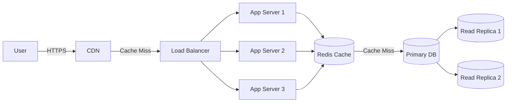
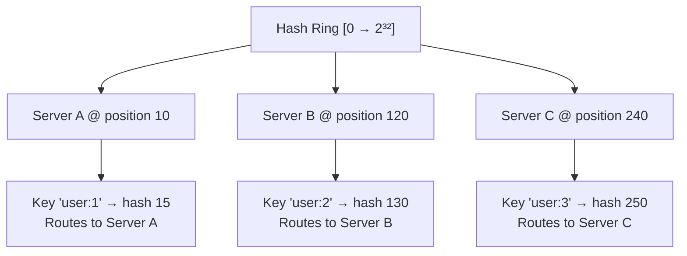
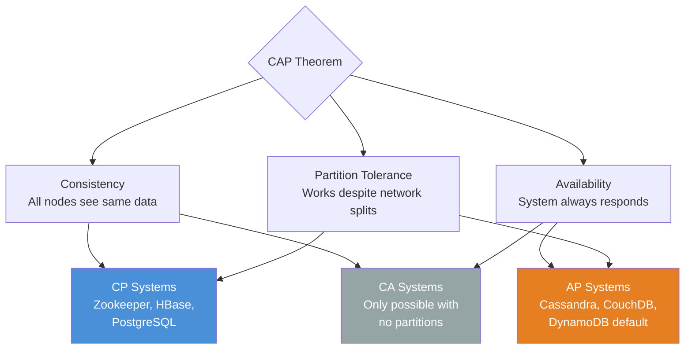
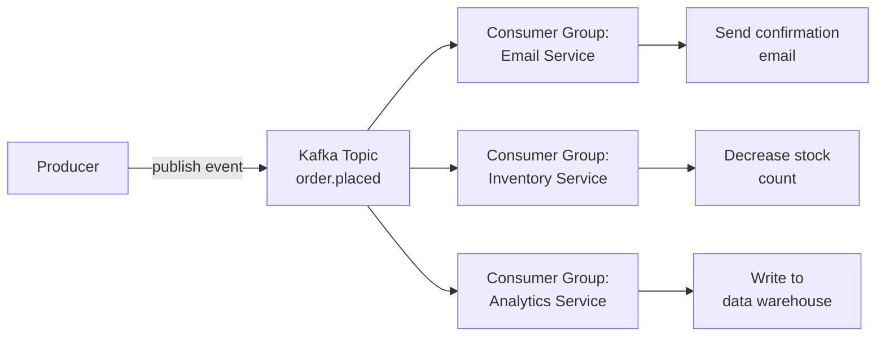

## Basic Application Architecture

### Developer Perspective

A typical application is composed of:

- **Build & Deploy Layer** — CI/CD pipeline
- **Server Layer** — handles incoming requests
- **Storage Layer** — persists application data (can be external)
- **Logging Storage Server** — logs all events
- **Metric Storage Server** — logs all metrics
- **Alert Server** — alerts when something goes down

### User Perspective

Users simply make requests to the server and receive responses.

### System Architecture Overview



---

### Scaling

- **Vertical Scaling:** add more physical resources (CPU, RAM) to a single server
- **Horizontal Scaling:** add more servers to distribute the load
- **Load Balancer:** distributes traffic between multiple servers


---

## Design Requirements

### How We Handle Data

| Concern | Description |
|---|---|
| **Move data** | Data moves between servers in different parts of the world |
| **Store data** | How we persist our data |
| **Transform data** | Transforming data to answer queries or perform computations |

### Metrics for Evaluating Our Design

**Availability** — measures uptime of a system:

$$\text{Availability} = \frac{\text{uptime}}{\text{uptime} + \text{downtime}}$$

Example:

$$\frac{23 \text{ hours}}{23 \text{ hours} + 1 \text{ hour}} = 96\%$$

| Availability | Downtime per year | Downtime per month |
|---|---|---|
| 99% ("two nines") | ~3.65 days | ~7.3 hours |
| 99.9% ("three nines") | ~8.77 hours | ~43.8 minutes |
| 99.99% ("four nines") | ~52.6 minutes | ~4.4 minutes |
| 99.999% ("five nines") | ~5.26 minutes | ~26 seconds |

> 💡 **Tip:** Each additional nine is roughly 10× harder to achieve. Going from 99.9% to 99.99% often requires redundant infrastructure, active-active deployments, and chaos engineering.

**SLI** — Service Level Indicator: measures performance of a system

**SLO** — Service Level Objective: target goals for SLI (e.g., 99.9% availability)

**SLA** — Service Level Agreement: contracts with customers for SLO

**Reliability** — measures the probability of a system failing

**Fault Tolerance** — measures how much our system can continue working under failure

**Redundancy** — measures how much our system is replicated

**Throughput** — measures the number of operations in a time frame:

$$\text{Throughput} = \frac{\text{operations}}{\text{time}} = \frac{\text{queries}}{\text{seconds}} = \frac{\text{bytes}}{\text{seconds}}$$

**Latency** — measures how long it takes to complete a request

---

## Networks

### Basics

| Concept | Description |
|---|---|
| **Packages** | Encapsulate data to be transferred over the network |
| **IP Address** | Virtual identification of a host |
| **MAC Address** | Physical identification of a host |
| **NAT** | Translates public IP to private within a LAN. Devices in a LAN have their own private IPs and access the internet using a single public IP |
| **Port Forwarding** | Network technique that enables external users to access specific services on a private, local network |


**Router** — sends packages across the network

### Basic Protocols

| Protocol | Description |
|---|---|
| **HTTP** | Exchange hyper-text information |
| **SSH** | Remote connection to a host |
| **TCP** | Stateful communication, 3-way handshake, congestion handling, retransmission of lost packages |
| **UDP** | Non-stateful communication, no guarantees |

> 💡 **Tip:** Use **UDP** for real-time applications (video calls, games) where occasional packet loss is acceptable but latency must be minimal. Use **TCP** when every byte must arrive in order (file transfers, APIs).

---

## API Design

### Client-Server Model

- **Client** — accesses information provided by a server
- **Server** — provides resources


### RPC — Remote Procedure Call

The RPC model allows a program to execute code in a different machine or address space.


Key concepts:
- **Stub** — function proxy on both local and remote server
- **Marshalling** — packaging parameters into a message ready to be sent
- **Unmarshalling** — unpacking parameters from the received message

### HTTP / HTTPS

**HTTP** is the protocol for client-server communication. **TLS/SSL** encrypts traffic between client and server.

**Methods:**

| Method | Purpose |
|---|---|
| GET | Retrieve resources |
| POST | Create resources |
| PUT | Update/replace resources |
| DELETE | Remove resources |

**Status Codes:**

| Range | Meaning |
|---|---|
| 1xx | Informational |
| 2xx | Successful |
| 3xx | Redirection |
| 4xx | Client Error |
| 5xx | Server Error |

> **Cons:** HTTP is not ideal for real-time data exchange

### WebSockets

WebSockets establish a persistent, full-duplex connection between client and server — unlike REST where each request creates a new connection.


**Pros:**
- Bi-directional communication
- Great for real-time data (chat, live feeds)
- Supports server push and polling

### API Paradigms

#### REST
- **Stateless** — server doesn't maintain session state
- **Pagination** — page through resources
- **Cacheable** — responses can be cached
- **Resource-identified** — resources have unique URIs, exchanged in JSON
- **Layered** — client and server are decoupled; can talk to replicas transparently

#### GraphQL
- Uses only **POST** requests
- Body contains queries for fetching data
- Less cacheable compared to REST

#### gRPC
- Typically used for **server-to-server** communication
- Implements RPC with schema-defined data
- **Faster** than REST
- Supports **bi-directional streaming**
- Uses exceptions instead of status codes
- Built on **HTTP/2**

### API Design Best Practices

**API Contract** — defines the structure of your API

**Handling API changes:**
- **Adding parameters** → make them optional
- **Removing parameters** → can break external customers

**Pagination** — limit the number of returned objects:
```
GET https://api.example.com/v1/users/:id/tweets?limit=10&offset=0
```

**HTTP Idempotency** — making the same request multiple times produces the same effect:

| Method | Idempotent? |
|---|---|
| GET | ✅ Yes |
| PUT | ✅ Yes |
| DELETE | ✅ Yes |
| POST | ⚠️ Depends on implementation |

#### Rate Limiting

Rate limiting protects backend services from abuse and accidental overload.

Common algorithms:
- **Token Bucket** — tokens refill at a fixed rate; requests consume tokens. Allows short bursts.
- **Leaky Bucket** — requests are processed at a fixed rate; excess requests are queued or dropped. Smooths output traffic.
- **Fixed Window** — count requests per time window (for example, 1000 req/min). Simple but vulnerable to boundary bursts.
- **Sliding Window** — tracks requests over a rolling window. More accurate than fixed windows, but uses more memory.

Practical selection guidance:
- **Token Bucket** when APIs must tolerate short bursts without overwhelming downstream systems.
- **Leaky Bucket** when you need steady outbound flow to protect a constrained backend.
- **Fixed Window** when implementation simplicity matters more than strict fairness.
- **Sliding Window** when enforcement accuracy is more important than memory overhead.

When clients exceed limits, return `429 Too Many Requests` with a `Retry-After` header.

Common implementations include NGINX rate limiting, Redis + Lua scripts, and API Gateway products such as Kong and AWS API Gateway.

---

## Caching

### Basics of Cache

| Term | Description |
|---|---|
| **Cache Hit** | Data is found in cache |
| **Cache Miss** | Data is not in cache or is expired |
| **Cache TTL** | Maximum time data can stay in cache |
| **Cache Stale** | Maximum age of expired data |

**Cache Hit Ratio:**

$$\text{Cache Ratio} = \frac{\text{hits}}{\text{hits} + \text{misses}}$$

### Client-Side Caching

1. Check **memory cache** first
2. Cache miss → check **disk cache**
3. Cache miss → make **network request**

### Server-Side Caching Strategies

#### Read Through


Best for **read-heavy** systems: CDNs, social media feeds, user profiles.

#### Cache Aside (Lazy Loading)


Data is stored in cache **only when needed**. Best for systems with high **read-to-write** ratio (prices, descriptions, stock status).

#### Write Around


Only frequently accessed data resides in cache. Best for **write-heavy systems** where data is not immediately read (logging systems).

#### Write Through


DB and cache are kept **in sync**. Best for **consistency-critical systems** — financial applications, online transaction processing.

#### Write Back


Writes go to cache first, then **asynchronously flushed** to the database. Ideal for **write-heavy** scenarios where immediate consistency isn't critical (logging, social media feeds).

> ⚠️ **Warning:** Write-back caching risks data loss if the cache crashes before flushing to the database. Always evaluate your durability requirements before using it.

#### Strategies Summary


### Cache Eviction Policies

**Eviction Policies** determine which elements are removed when the cache is full.

#### FIFO (First In, First Out)
Implemented with a **queue**. The oldest item is evicted first.

#### LRU (Least Recently Used)


Uses a **Hash Map** + **Doubly Linked List**:
- Hash Map: key → pointer to a node in the linked list
- Doubly Linked List: maintains access order (head = most recently accessed)

#### LFU (Least Frequently Used)

Uses two maps and a frequency tracker:
- `key_map`: key → node
- `freq_map`: frequency → doubly linked list of nodes
- `min_freq`: integer tracking the minimum frequency

```
            key_map
    ┌────────────────────┐
    │ A → Node(freq=3)   │
    │ B → Node(freq=1)   │
    │ C → Node(freq=1)   │
    │ D → Node(freq=2)   │
    └─────────┬──────────┘
              │
              ▼
          freq_map
┌─────────────────────────────────┐
│  freq = 1 → [HEAD ⇄ C ⇄ B ⇄ TAIL] │
│              ↑MRU   ↑LRU           │
│  freq = 2 → [HEAD ⇄ D ⇄ TAIL]     │
│  freq = 3 → [HEAD ⇄ A ⇄ TAIL]     │
└─────────────────────────────────┘
  min_freq = 1
```

---

## CDN (Content Delivery Network)

**CDN Servers** are groups of static content cache servers placed **close to end users** for low latency.

### Push CDN

The origin server **pushes** data to CDN edge nodes proactively.


### Pull CDN

CDN edge nodes **pull** data from the origin server on cache miss.


---

## Proxies

**Proxies** are a middle layer between client and server.


### Forward Proxy


- **Client identity is hidden** from the server
- Proxy can **cache results** and **filter traffic**
- Protects the **client**

### Reverse Proxy


- **Server identity is hidden** from the client
- Proxy forwards requests to the **correct backend server**
- Handles **SSL termination** and **caching**
- Protects the **servers**

### SSL Termination

SSL connection ends at the proxy. Internal traffic from proxy to server uses plain HTTP.


### SSL Pass Through

All traffic remains encrypted end-to-end. The proxy forwards encrypted traffic without decrypting.

---

## Load Balancer

A **load balancer** is a reverse proxy that distributes traffic to backend servers.

### Round Robin

Requests cycle through servers in order: A → B → C → A → B → C...


### Weighted Round Robin

Same circular pattern, but servers with higher **weight** receive proportionally more traffic.


### Least Connections

Routes new requests to the server with the **fewest active connections**.


### User Location

Routes based on the user's **geographic location** for lowest latency.

### Regular Hashing

Same IP always maps to the same server:

$$\text{Dest-Server} = \text{Client-IP} \mod N_{\text{servers}}$$


> **Problem:** If a server goes down, **all** hash mappings need to be recalculated.

### Consistent Hashing

Servers and keys are mapped onto a **hash ring**. Keys route clockwise to the nearest server. When a server is removed, only its keys are redistributed.


### Consistent Hashing Deep Dive

With regular modular hashing, adding or removing a server changes `N`, so most keys are remapped:

`server = hash(key) % N`

Consistent hashing places both keys and servers on the same logical ring `[0, 2^32)`. To route a request, hash the key and move clockwise to the next server position on the ring. When a server is added or removed, only nearby key ranges move.



**Virtual nodes (vnodes)** map each physical server to multiple ring positions to improve balance. Without vnodes, random placement can make one server own a disproportionately large arc and receive most traffic.

This approach is used in Cassandra, DynamoDB, Amazon load balancing systems, and many Memcached client libraries.

Trade-off: implementation is slightly more complex, but lookup is typically **O(log N)** with a sorted map or tree structure.

### Layer 4 vs Layer 7 Load Balancing

| Type | Level | Speed | Intelligence |
|---|---|---|---|
| **Layer 4** | Transport (TCP/UDP) | Faster | Basic routing |
| **Layer 7** | Application (HTTP) | Slower | Content-aware routing |

---

## Storage

### RDBMS (Relational Databases)

**SQL** is the language to query relational databases. Data is stored in **tables** on disk.

#### B+ Tree Index

Relational databases implement indexing using **B+ Trees** for O(log n) I/O operations.


Key properties:
- Every node can have **m** children
- Each node has **m-1** values
- Data is stored **only on leaf nodes**
- Leaf level forms a **sorted linked list**
- Root/internal nodes are used to efficiently locate data on leaf nodes

| Index Type | Best for | Trade-off |
|---|---|---|
| B+ Tree | Range queries, sorted access | Slower writes |
| Hash Index | Exact-match lookups | No range queries |
| Composite Index | Multi-column WHERE clauses | Column order matters |
| Covering Index | Queries answered entirely from index | More storage |
| Full-Text Index | `LIKE` / text search | Not for numeric data |

#### Table Structure


**Data Schema** defines how data is structured:

```sql
CREATE TABLE People (
    PhoneNumber int PRIMARY KEY,
    Name varchar(100)
);
```

**Foreign Keys** link two tables together. **Joins** combine tables based on conditions.

#### ACID Properties

| Property | Description |
|---|---|
| **Atomicity** | Transaction is all-or-nothing. If any step fails, the entire transaction rolls back |
| **Consistency** | Transactions only bring the DB from one consistent state to another |
| **Isolation** | Concurrent transactions execute as if running in isolation |
| **Durability** | Once committed, data persists even after system failure (stored on disk) |

### NoSQL

| Type | Description | Examples |
|---|---|---|
| **Key-Value** | Stores data as key-value pairs | Redis, Memcached, etcd |
| **Document** | Stores data as JSON documents | MongoDB |
| **Wide-Column** | Stores data in columns instead of rows | Cassandra, Google Bigtable |
| **Graph** | Stores data as relationships between objects | Neo4j |

#### BASE Properties

| Property | Description |
|---|---|
| **Basically Available** | All users can access the database concurrently |
| **Soft State** | Data can have multiple intermediate states |
| **Eventually Consistent** | Consistency is achieved once all replicas are updated |

#### Eventually Consistent vs Strict Consistency

**Eventually Consistent:** Client writes to the master node and receives ACK immediately. The master node updates slaves **asynchronously**.


**Strictly Consistent:** Data is written to the master and **immediately copied** to all slaves. Client receives ACK only after all slaves confirm.


### Replication and Sharding

#### Synchronous Replication
Master replicates data on slaves **at write time**. Used when **critical consistency** is needed.

#### Asynchronous Replication
Master replicates data on slaves **later**. Used when consistency can be **eventually** achieved.

#### Master-Master Replication
Multiple masters replicate each other and each replicates its own slaves. Ideal for **multi-region** setups with one master per region.

#### Sharding

**Sharding** divides data into partitions based on a **shard key**.


**Use cases:** massive, high-traffic systems

- **Relational databases** — sharding is done at the application level
- **NoSQL databases** — horizontal scaling per shard

| Strategy | How it works | Pros | Cons |
|---|---|---|---|
| **Range sharding** | Rows with key in [A–M] → Shard 1, [N–Z] → Shard 2 | Simple range queries | Hotspots if data is skewed |
| **Hash sharding** | `shard = hash(key) % N` | Uniform distribution | No range queries; resharding is expensive |
| **Directory sharding** | A lookup table maps keys → shards | Flexible | Lookup table is a SPOF; extra hop |
| **Geo sharding** | Data partitioned by user geography | Low latency | Cross-region queries are hard |

> ⚠️ **Warning:** Avoid sharding until you genuinely need it. It adds enormous operational complexity and makes cross-shard transactions nearly impossible. Try vertical scaling, read replicas, and caching first.

## CAP Theorem

In distributed systems, CAP refers to three properties:

- **Consistency (C):** every read receives the most recent write (or an error), so all nodes present the same logical value.
- **Availability (A):** every request receives a non-error response, even if that response may not reflect the latest write.
- **Partition Tolerance (P):** the system continues operating despite network splits where nodes cannot communicate reliably.




Why can you only guarantee two properties at once? During a network partition, nodes are split into groups that cannot talk to each other. At that moment, you must choose:
- keep serving traffic on both sides (**Availability**) and risk divergent data (**weaken Consistency**), or
- reject operations on one side until quorum is restored (**Consistency**) and sacrifice immediate responses (**weaken Availability**).

| System | Type | Why |
|---|---|---|
| PostgreSQL / MySQL | CP | Refuses writes during partition to stay consistent |
| Apache Cassandra | AP | Accepts writes during partition, syncs later |
| Apache Zookeeper | CP | Stops accepting writes if quorum is lost |
| CouchDB | AP | Multi-master, eventual consistency |
| HBase | CP | Built on HDFS, prioritizes consistency |
| DynamoDB | AP (tunable) | Adjustable consistency per request |

CAP explains behavior during partitions, but real systems also optimize for normal operation. **PACELC** extends CAP with latency trade-offs:

`if Partition → (Availability vs. Consistency) else (Latency vs. Consistency)`

Examples:
- **DynamoDB:** often described as **PA/EL** (favoring availability under partition and latency when healthy).
- **Spanner:** often described as **PC/EC** (favoring consistency in both partitioned and healthy scenarios).

> 📖 **Deep Dive:** Read the original Dynamo paper for a real-world AP system: [Amazon Dynamo (2007)](https://www.allthingsdistributed.com/files/amazon-dynamo-sosp2007.pdf)

## Message Queues & Event Streaming

Asynchronous messaging is a core scaling pattern:
- It decouples producers from consumers.
- It absorbs traffic spikes through buffering.
- It enables fan-out, where one event triggers many downstream services.

| Guarantee | Description | Risk |
|---|---|---|
| At-most-once | Fire and forget | Data loss possible |
| At-least-once | Retry until ACK | Duplicates possible |
| Exactly-once | Idempotent + transactional | Most expensive |

| Feature | Kafka | RabbitMQ | SQS |
|---|---|---|---|
| Model | Log / pull | Queue / push | Queue / pull |
| Ordering | Partition-level | Per-queue | FIFO queue option |
| Retention | Configurable (days/weeks) | Until consumed | Up to 14 days |
| Throughput | Very high | High | High |
| Replay | Yes (seek offset) | No | No |
| Best for | Event streaming, analytics | Task queues, microservices | Serverless, AWS-native |

In Kafka, a **consumer group** lets multiple consumers share work: each partition is assigned to one consumer in the group, enabling parallel processing without duplicate consumption inside that group.



## Observability

Observability tells you not just that a system is failing, but where and why it is failing.

> 💡 **Tip:** Instrument your services with **OpenTelemetry** from day one — it's vendor-neutral and lets you switch backends (Jaeger, Zipkin, Honeycomb) without changing your code.

### The Three Pillars

| Pillar | What it answers | Tool examples |
|---|---|---|
| **Logs** | What happened? | ELK Stack, Loki, Splunk |
| **Metrics** | How is the system performing over time? | Prometheus, Datadog, CloudWatch |
| **Traces** | Where did a request spend its time? | Jaeger, Zipkin, OpenTelemetry |

### Golden Signals (Google SRE)

- **Latency** — time to serve a request (distinguish success vs. error latency)
- **Traffic** — demand on the system (req/sec)
- **Errors** — rate of failed requests (4xx/5xx)
- **Saturation** — how "full" the service is (CPU %, memory %, queue depth)

### Prometheus + Grafana Stack

- Prometheus scrapes `/metrics` endpoints using a pull model.
- Alertmanager fires alerts when thresholds are crossed.
- Grafana visualizes time-series data and dashboards.

```python
from prometheus_client import Counter, start_http_server

REQUEST_COUNT = Counter('http_requests_total', 'Total HTTP requests', ['method', 'endpoint'])

def handle_request(method, endpoint):
    REQUEST_COUNT.labels(method=method, endpoint=endpoint).inc()
    # ... handle request

start_http_server(8000)  # exposes /metrics on port 8000
```

## Further Reading & Resources

### 📚 Books
- <a href="https://dataintensive.net">*Designing Data-Intensive Applications*</a> — Martin Kleppmann — the definitive book on distributed systems
- <a href="https://bytebytego.com">*System Design Interview Vol. 1 & 2*</a> — Alex Xu — practical interview preparation
- *The Art of Scalability* — Abbott & Fisher — organizational and technical scaling

### 🌐 Free Online Resources
- <a href="https://github.com/donnemartin/system-design-primer">System Design Primer</a> — 240k+ GitHub stars, comprehensive guide
- <a href="https://bytebytego.com">ByteByteGo Newsletter</a> — weekly system design deep dives
- <a href="https://sre.google/sre-book/table-of-contents/">Google SRE Book</a> — free, authoritative guide to running production systems
- <a href="https://martinfowler.com/architecture/">Martin Fowler — Patterns of Enterprise Architecture</a> — architectural patterns explained
- <a href="http://highscalability.com">High Scalability Blog</a> — real-world architecture case studies

### 📄 Foundational Papers
- <a href="https://www.allthingsdistributed.com/files/amazon-dynamo-sosp2007.pdf">Amazon Dynamo (2007)</a> — the paper that defined modern AP databases
- <a href="https://research.google/pubs/bigtable-a-distributed-storage-system-for-structured-data/">Google Bigtable (2006)</a> — wide-column store at planetary scale
- <a href="https://research.google/pubs/spanner-googles-globally-distributed-database/">Google Spanner (2012)</a> — globally distributed CP database

### 🛠️ Practice
- <a href="https://excalidraw.com">Excalidraw</a> — whiteboard diagrams for design interviews
- <a href="https://www.pramp.com">Pramp</a> — free mock system design interviews
