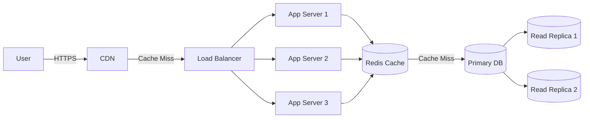
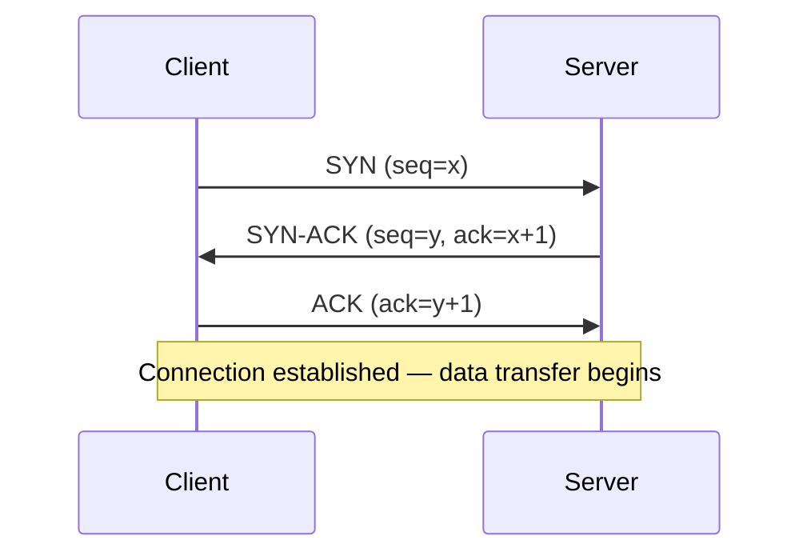
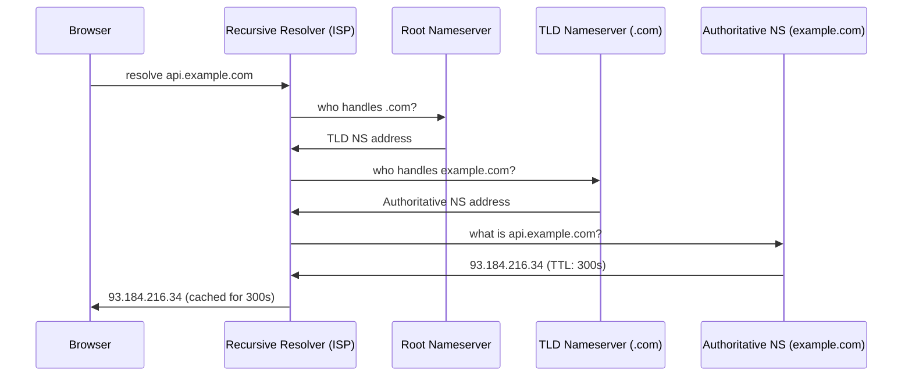
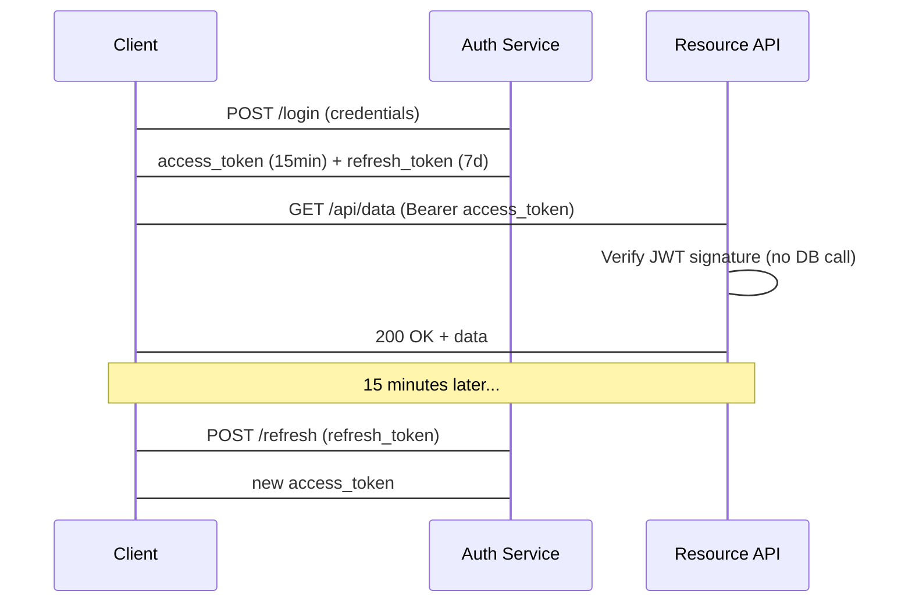
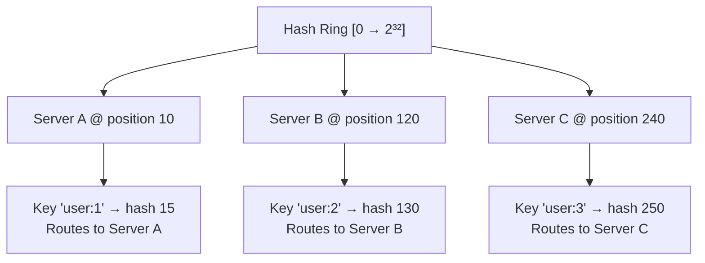
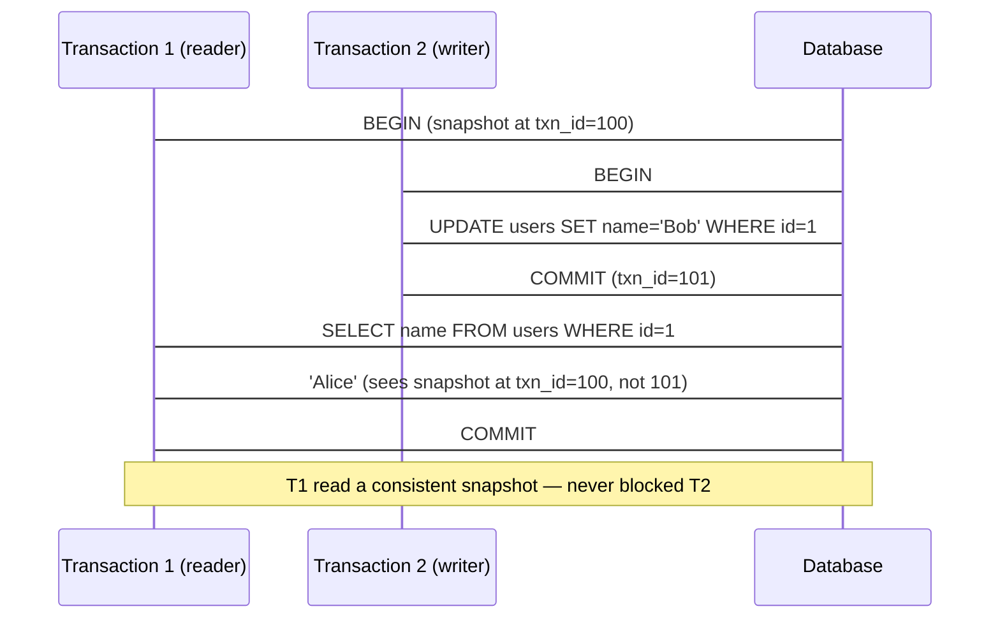
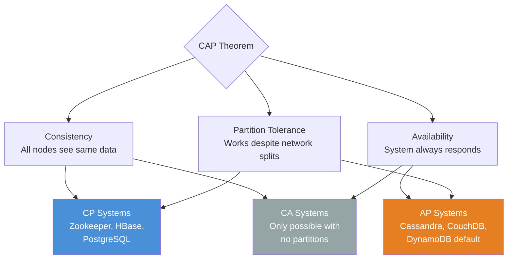
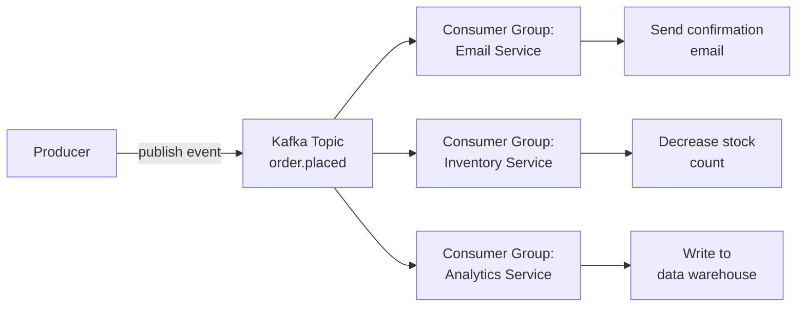

## Basic Application Architecture

### Developer Perspective

A typical application is composed of:

- **Build & Deploy Layer** — CI/CD pipeline
- **Server Layer** — handles incoming requests
- **Storage Layer** — persists application data (can be external)
- **Logging Storage Server** — logs all events
- **Metric Storage Server** — logs all metrics
- **Alert Server** — alerts when something goes down

#### Stateless vs Stateful Services

- **Stateless**: the server holds no session data between requests. Any instance can serve any request. Enables effortless horizontal scaling.
- **Stateful**: the server holds session data (e.g. WebSocket connections, in-memory cart). Requires sticky sessions (session affinity at the load balancer) or externalizing state to Redis/a DB.

| | Stateless | Stateful |
|---|---|---|
| Horizontal scaling | Trivial — add instances freely | Hard — requires sticky sessions or external state |
| Fault tolerance | High — any replica serves the request | Low — losing a server loses its session data |
| Examples | REST APIs, static servers | WebSocket servers, game servers, video call nodes |

### User Perspective

Users simply make requests to the server and receive responses.

### System Architecture Overview



#### Single Points of Failure

| Layer | SPOF risk | Mitigation |
|---|---|---|
| Server | Single app server fails → full outage | Horizontal scaling + load balancer |
| Load balancer | LB fails → full outage | Active-active LB pair with floating IP (VRRP) |
| Database | Single DB fails → data unavailable | Primary + read replicas, automatic failover |
| Storage | Single disk fails → data loss | RAID, object storage with replication (S3 11-nines durability) |

---

### Scaling

- **Vertical Scaling:** add more physical resources (CPU, RAM) to a single server
- **Horizontal Scaling:** add more servers to distribute the load
- **Load Balancer:** distributes traffic between multiple servers

#### Vertical Scaling Limits

> ⚠️ **Warning:** Vertical scaling has a hard ceiling. The largest cloud instances (e.g. AWS `u-24tb1.metal`) top out at ~448 vCPUs and 24 TB RAM and cost thousands of dollars per hour. Beyond that, horizontal scaling is the only option.


---

## Design Requirements

### How We Handle Data

| Concern | Description |
|---|---|
| **Move data** | Data moves between servers in different parts of the world |
| **Store data** | How we persist our data |
| **Transform data** | Transforming data to answer queries or perform computations |

### Metrics for Evaluating Our Design

**Availability** — measures uptime of a system:

$$\text{Availability} = \frac{\text{uptime}}{\text{uptime} + \text{downtime}}$$

Example:

$$\frac{23 \text{ hours}}{23 \text{ hours} + 1 \text{ hour}} = 96\%$$

| Availability | Downtime per year | Downtime per month |
|---|---|---|
| 99% ("two nines") | ~3.65 days | ~7.3 hours |
| 99.9% ("three nines") | ~8.77 hours | ~43.8 minutes |
| 99.99% ("four nines") | ~52.6 minutes | ~4.4 minutes |
| 99.999% ("five nines") | ~5.26 minutes | ~26 seconds |

> 💡 **Tip:** Each additional nine is roughly 10× harder to achieve. Going from 99.9% to 99.99% often requires redundant infrastructure, active-active deployments, and chaos engineering.

**SLI / SLO / SLA** — worked example:

```
SLI  = (successful requests / total requests) × 100
SLO  = "API availability SLI ≥ 99.9% over a rolling 30-day window"
SLA  = contract: if SLO is breached, customer receives 10% service credit
```

#### Error Budget

The error budget is the allowed failure quota derived directly from the SLO:

$$\text{Error Budget} = 1 - \text{SLO} = 1 - 0.999 = 0.001 = 43.8 \text{ min/month}$$

Assuming a 30.44-day average month (\(365.25/12\)): \(0.001 \times 30.44 \times 24 \times 60 \approx 43.8\) minutes (rounded to one decimal place).

- Teams spend the error budget on deployments, experiments, and planned maintenance.
- When the budget is exhausted, all risky changes freeze until the window resets.
- This creates a healthy tension between reliability (SRE) and feature velocity (Dev).

**Reliability** — measures the probability of a system failing

#### Reliability

$$\text{MTBF} = \frac{\text{Total uptime}}{\text{Number of failures}} \qquad \text{MTTR} = \frac{\text{Total downtime}}{\text{Number of failures}}$$

$$\text{Availability} = \frac{\text{MTBF}}{\text{MTBF} + \text{MTTR}}$$

Improving availability means either increasing MTBF (fewer failures — better code, hardware) or decreasing MTTR (faster recovery — better alerting, runbooks, auto-remediation).

**Fault Tolerance** — measures how much our system can continue working under failure

**Redundancy** — measures how much our system is replicated

**Throughput** — measures the number of operations in a time frame:

$$\text{Throughput} = \frac{\text{operations}}{\text{time}} = \frac{\text{queries}}{\text{seconds}} = \frac{\text{bytes}}{\text{seconds}}$$

**Latency** — measured as a **percentile distribution**, not a mean:

| Percentile | Meaning |
|---|---|
| p50 (median) | Half of requests are faster than this |
| p95 | 95% of requests are faster than this |
| p99 | 99% of requests are faster than this — what most users experience at the tail |
| p999 | 1-in-1000 requests — the "long tail" that affects your biggest/most active users |

> 💡 **Tip:** Always design to a p99 target, not a mean. A mean of 50ms can hide a p99 of 2,000ms. Users at the tail are often your highest-value customers (power users making the most requests).

---

## Networks

### Basics

| Concept | Description |
|---|---|
| **Packages** | Encapsulate data to be transferred over the network |
| **IP Address** | Virtual identification of a host |
| **MAC Address** | Physical identification of a host |
| **NAT** | Translates public IP to private within a LAN. Devices in a LAN have their own private IPs and access the internet using a single public IP |
| **Port Forwarding** | Network technique that enables external users to access specific services on a private, local network |


**Router** — sends packages across the network

### Basic Protocols

| Protocol | Description |
|---|---|
| **HTTP** | Exchange hyper-text information |
| **SSH** | Remote connection to a host |
| **TCP** | Stateful communication, 3-way handshake, congestion handling, retransmission of lost packages |
| **UDP** | Non-stateful communication, no guarantees |

> 💡 **Tip:** Use **UDP** for real-time applications (video calls, games) where occasional packet loss is acceptable but latency must be minimal. Use **TCP** when every byte must arrive in order (file transfers, APIs).

#### TCP Three-Way Handshake

Every TCP connection requires 1 full round-trip before data can flow:



Cost implications:
- 1 RTT overhead per new TCP connection
- HTTPS adds another 1-2 RTTs for the TLS handshake on top
- This is why connection pooling and HTTP/2 multiplexing matter so much at scale

> 💡 **Tip:** Connection pooling (PgBouncer for Postgres, HikariCP for Java) amortises the TCP + TLS handshake cost across many requests. At scale, a fresh TLS handshake per request can cost 50–100ms — more than the query itself.

#### DNS Resolution

DNS translates human-readable hostnames into IP addresses. The resolution chain:



Key system design implications:
- **TTL controls propagation delay** — low TTL = faster failover, higher DNS load; high TTL = slower failover, less load
- **GeoDNS** — return different IPs based on the requester's geographic location (closest region)
- **DNS-based load balancing** — return multiple A records; clients round-robin. Simple but no health checks.

#### TLS Handshake

TLS adds encryption, authentication, and integrity on top of TCP. Modern TLS 1.3 takes 1 RTT (vs 2 RTTs for TLS 1.2):

1. **ClientHello** — client sends supported cipher suites, TLS version, random nonce
2. **ServerHello + Certificate** — server chooses cipher, sends its X.509 certificate
3. **Key Exchange** — both sides derive the same session key using ECDHE (no key transmitted)
4. **Finished** — both sides confirm encryption is working; data flow begins

> 💡 **Tip:** TLS termination at a load balancer means internal traffic is unencrypted. For regulated industries (healthcare, finance), use **mTLS** (mutual TLS) internally so every service authenticates both directions.

#### HTTP/1.1 vs HTTP/2 vs HTTP/3

| Feature | HTTP/1.1 | HTTP/2 | HTTP/3 |
|---|---|---|---|
| Transport | TCP | TCP | QUIC (UDP) |
| Multiplexing | No — one request per connection | Yes — multiple streams per connection | Yes |
| Head-of-line blocking | Per-connection | TCP-level (one lost packet stalls all streams) | Eliminated — per-stream |
| Header compression | None | HPACK | QPACK |
| Connection setup | TCP + TLS = 2 RTT | TCP + TLS = 2 RTT | 0-RTT possible |
| Best for | Legacy systems | Most modern APIs | Mobile, lossy networks |

> 📖 **Deep Dive:** HTTP/3 and QUIC are defined in [RFC 9000](https://www.rfc-editor.org/rfc/rfc9000). Cloudflare's blog has an excellent series on their real-world QUIC deployment.

---

## API Design

### Client-Server Model

- **Client** — accesses information provided by a server
- **Server** — provides resources


### RPC — Remote Procedure Call

The RPC model allows a program to execute code in a different machine or address space.


Key concepts:
- **Stub** — function proxy on both local and remote server
- **Marshalling** — packaging parameters into a message ready to be sent
- **Unmarshalling** — unpacking parameters from the received message

### HTTP / HTTPS

**HTTP** is the protocol for client-server communication. **TLS/SSL** encrypts traffic between client and server.

**Methods:**

| Method | Purpose |
|---|---|
| GET | Retrieve resources |
| POST | Create resources |
| PUT | Update/replace resources |
| DELETE | Remove resources |

**Status Codes:**

| Range | Meaning |
|---|---|
| 1xx | Informational |
| 2xx | Successful |
| 3xx | Redirection |
| 4xx | Client Error |
| 5xx | Server Error |

> **Cons:** HTTP is not ideal for real-time data exchange

### WebSockets

WebSockets establish a persistent, full-duplex connection between client and server — unlike REST where each request creates a new connection.


**Pros:**
- Bi-directional communication
- Great for real-time data (chat, live feeds)
- Supports server push and polling

### API Paradigms

#### REST
- **Stateless** — server doesn't maintain session state
- **Pagination** — page through resources
- **Cacheable** — responses can be cached
- **Resource-identified** — resources have unique URIs, exchanged in JSON
- **Layered** — client and server are decoupled; can talk to replicas transparently

#### GraphQL

GraphQL lets clients request exactly the data they need — no over-fetching (getting unused fields) or under-fetching (needing multiple requests for related data).

**The N+1 Query Problem** — GraphQL's most common performance trap:

```python
# Naive resolver — fires 1 DB query per user (N+1 total)
def resolve_posts(root, info):
    posts = db.query("SELECT * FROM posts")          # 1 query
    for post in posts:
        post.author = db.query(                       # N queries
            "SELECT * FROM users WHERE id = ?",
            post.author_id
        )
    return posts
```

Solution: **DataLoader** — batches all author lookups into a single `SELECT * FROM users WHERE id IN (...)` query.

| | REST | GraphQL | gRPC |
|---|---|---|---|
| Protocol | HTTP/1.1+ | HTTP/1.1+ | HTTP/2 |
| Data format | JSON | JSON | Protobuf (binary) |
| Schema | OpenAPI (optional) | SDL (required) | .proto (required) |
| Type safety | Weak | Strong | Strong |
| Caching | HTTP cache (GET) | Hard (POST only) | Custom |
| Browser support | Native | Native | Needs gRPC-Web |
| Best for | Public APIs | Complex client needs | Internal microservices |
| Streaming | SSE / WebSocket | Subscriptions | Native bi-directional |

#### gRPC
- Typically used for **server-to-server** communication
- Implements RPC with schema-defined data
- **Faster** than REST
- Supports **bi-directional streaming**
- Uses exceptions instead of status codes
- Built on **HTTP/2**

Cons:
- **No native browser support** — requires gRPC-Web proxy (Envoy) or gRPC-Web library
- **Binary protocol** — harder to debug than JSON (need protoc or grpcurl)
- **Schema evolution rules** — never change field numbers; only add new fields; deprecate with `reserved`
- **Tight coupling** — both sides must share the `.proto` schema file

### API Design Best Practices

**API Contract** — defines the structure of your API

**Handling API changes:**
- **Adding parameters** → make them optional
- **Removing parameters** → can break external customers

**Pagination** — limit the number of returned objects:
```
GET https://api.example.com/v1/users/:id/tweets?limit=10&offset=0
```

**HTTP Idempotency** — making the same request multiple times produces the same effect:

| Method | Idempotent? |
|---|---|
| GET | ✅ Yes |
| PUT | ✅ Yes |
| DELETE | ✅ Yes |
| POST | ⚠️ Depends on implementation |

#### Rate Limiting

Rate limiting protects backend services from abuse and accidental overload.

Common algorithms:
- **Token Bucket** — tokens refill at a fixed rate; requests consume tokens. Allows short bursts.
- **Leaky Bucket** — requests are processed at a fixed rate; excess requests are queued or dropped. Smooths output traffic.
- **Fixed Window** — count requests per time window (for example, 1000 req/min). Simple but vulnerable to boundary bursts.
- **Sliding Window** — tracks requests over a rolling window. More accurate than fixed windows, but uses more memory.

Practical selection guidance:
- **Token Bucket** when APIs must tolerate short bursts without overwhelming downstream systems.
- **Leaky Bucket** when you need steady outbound flow to protect a constrained backend.
- **Fixed Window** when implementation simplicity matters more than strict fairness.
- **Sliding Window** when enforcement accuracy is more important than memory overhead.

When clients exceed limits, return `429 Too Many Requests` with a `Retry-After` header.

Common implementations include NGINX rate limiting, Redis + Lua scripts, and API Gateway products such as Kong and AWS API Gateway.

#### Authentication & Authorisation

| Pattern | How it works | Best for |
|---|---|---|
| API Key | Static secret in header (`X-API-Key`) | Server-to-server, simple integrations |
| Basic Auth | Base64(user:pass) in `Authorization` header | Legacy, internal tools (always over HTTPS) |
| OAuth2 + OIDC | Token-based delegated access, refresh tokens | Third-party login, user-facing apps |
| JWT | Self-contained signed token; no DB lookup to verify | Stateless APIs, microservices |
| mTLS | Both client and server present certificates | Internal service-to-service (zero trust) |

**JWT structure:**

```
header.payload.signature
```

```json
// Header
{ "alg": "RS256", "typ": "JWT" }

// Payload (claims — do NOT store sensitive data, it's only base64-encoded)
{ "sub": "user-123", "roles": ["admin"], "exp": 1742000000 }

// Signature = RS256(base64(header) + "." + base64(payload), private_key)
```



> ⚠️ **Warning:** JWTs cannot be revoked before expiry without a token blocklist (Redis set of revoked JWT IDs; token identifier claim = `jti`). Keep access token lifetime short (15 min) and use refresh tokens for renewal.

> 📖 **Deep Dive:** Read [RFC 7519](https://www.rfc-editor.org/rfc/rfc7519) for the JWT spec and [oauth.net](https://oauth.net/2/) for the full OAuth2 framework.

#### API Versioning

| Strategy | Example | Pros | Cons |
|---|---|---|---|
| URL versioning | `/v1/users` | Explicit, easy to route | Proliferates versions in URL |
| Header versioning | `Accept: application/vnd.api+json; version=2` | Clean URL | Less discoverable |
| Query param | `?version=2` | Simple | Easily forgotten |

Best practice: use URL versioning for public APIs, maintain at least 2 major versions simultaneously, and add a `Sunset` response header 6–12 months before deprecating:

```
Sunset: Sat, 01 Jan 2027 00:00:00 GMT
Deprecation: true
Link: <https://api.example.com/v2/users>; rel="successor-version"
```

---

## Caching

### Basics of Cache

| Term | Description |
|---|---|
| **Cache Hit** | Data is found in cache |
| **Cache Miss** | Data is not in cache or is expired |
| **Cache TTL** | Maximum time data can stay in cache |
| **Cache Stale** | Maximum age of expired data |

**Cache Hit Ratio:**

$$\text{Cache Ratio} = \frac{\text{hits}}{\text{hits} + \text{misses}}$$

### Client-Side Caching

1. Check **memory cache** first
2. Cache miss → check **disk cache**
3. Cache miss → make **network request**

### Server-Side Caching Strategies

#### Read Through


Best for **read-heavy** systems: CDNs, social media feeds, user profiles.

#### Cache Aside (Lazy Loading)


Data is stored in cache **only when needed**. Best for systems with high **read-to-write** ratio (prices, descriptions, stock status).

#### Write Around


Only frequently accessed data resides in cache. Best for **write-heavy systems** where data is not immediately read (logging systems).

#### Write Through


DB and cache are kept **in sync**. Best for **consistency-critical systems** — financial applications, online transaction processing.

#### Write Back


Writes go to cache first, then **asynchronously flushed** to the database. Ideal for **write-heavy** scenarios where immediate consistency isn't critical (logging, social media feeds).

> ⚠️ **Warning:** Write-back caching risks data loss if the cache crashes before flushing to the database. Always evaluate your durability requirements before using it.

#### Strategies Summary


### Cache Eviction Policies

**Eviction Policies** determine which elements are removed when the cache is full.

#### FIFO (First In, First Out)
Implemented with a **queue**. The oldest item is evicted first.

#### LRU (Least Recently Used)


Uses a **Hash Map** + **Doubly Linked List**:
- Hash Map: key → pointer to a node in the linked list
- Doubly Linked List: maintains access order (head = most recently accessed)

#### LFU (Least Frequently Used)

Uses two maps and a frequency tracker:
- `key_map`: key → node
- `freq_map`: frequency → doubly linked list of nodes
- `min_freq`: integer tracking the minimum frequency

```
            key_map
    ┌────────────────────┐
    │ A → Node(freq=3)   │
    │ B → Node(freq=1)   │
    │ C → Node(freq=1)   │
    │ D → Node(freq=2)   │
    └─────────┬──────────┘
              │
              ▼
          freq_map
┌─────────────────────────────────┐
│  freq = 1 → [HEAD ⇄ C ⇄ B ⇄ TAIL] │
│              ↑MRU   ↑LRU           │
│  freq = 2 → [HEAD ⇄ D ⇄ TAIL]     │
│  freq = 3 → [HEAD ⇄ A ⇄ TAIL]     │
└─────────────────────────────────┘
  min_freq = 1
```

#### Redis Data Structures

Redis is far more than a key-value store:

| Structure | Command | Use case |
|---|---|---|
| String | `SET/GET` | Simple cache, counters, rate limiting |
| Hash | `HSET/HGETALL` | User profile, session data |
| List | `LPUSH/RPOP` | Task queues, activity feeds |
| Sorted Set | `ZADD/ZRANGE` | Leaderboards, priority queues, time-series |
| HyperLogLog | `PFADD/PFCOUNT` | Approximate unique visitor counts (±0.81% error) |
| Pub/Sub | `PUBLISH/SUBSCRIBE` | Real-time notifications, chat |
| Stream | `XADD/XREAD` | Durable event log, Kafka-lite |

#### Cache Stampede (Thundering Herd)

When a popular cache key expires simultaneously for many concurrent requests, they all miss and hammer the database at once.

Three mitigations:

1. **Mutex / single-flight** — only one request fetches from DB; others wait for the cached result
2. **Probabilistic early expiration (PER)** — slightly before TTL expires, some requests proactively refresh:
   ```python
   import random, math
   def should_refresh(ttl_remaining, beta=1.0):
       return -math.log(random.random()) * beta > ttl_remaining
   ```
   `beta` controls refresh aggressiveness (higher beta refreshes earlier/more often; typical values are 0.5–2.0) because `-log(random()) * beta` grows with `beta`, so the expression exceeds `ttl_remaining` more often.
3. **Background refresh** — a background job refreshes cache before TTL expires; serving never misses

> 💡 **Tip:** In Go, `singleflight.Group` and in Java, Guava's `LoadingCache` implement the single-flight pattern out of the box — one request fetches, all others wait for the result.

#### Cache Invalidation Strategies

> 💡 **Tip:** "There are only two hard things in computer science: cache invalidation and naming things." — Phil Karlton

| Strategy | How it works | When to use |
|---|---|---|
| TTL expiry | Data expires after N seconds | Tolerable staleness, read-heavy |
| Event-driven | Write to DB triggers cache delete/update | Strong consistency requirement |
| Versioned keys | `user:123:v4` — bump version on write | Immutable deployments, CDN busting |
| Tag-based | Tag cache entries; invalidate by tag | Complex relationships (e.g. all posts by user X) |

#### Cache Penetration & Bloom Filters

Cache penetration: clients repeatedly query keys that don't exist in cache or DB (malicious or buggy). Every request falls through to DB.

Mitigation: **Bloom Filter** — a probabilistic data structure that answers "definitely not in DB" in O(1) with zero false negatives. If the Bloom filter says the key doesn't exist, skip the DB entirely.

```
Request key → Bloom Filter check
  ├─ "Definitely not in DB" → return 404 immediately (no DB hit)
  └─ "Maybe in DB" → check cache → check DB
```

---

## CDN (Content Delivery Network)

**CDN Servers** are groups of static content cache servers placed **close to end users** for low latency.

### Push CDN

The origin server **pushes** data to CDN edge nodes proactively.


### Pull CDN

CDN edge nodes **pull** data from the origin server on cache miss.


#### Cache-Control Headers

The origin server instructs CDN and browser caches via `Cache-Control`:

| Directive | Meaning |
|---|---|
| `max-age=3600` | Cache for 3600 seconds (client + CDN) |
| `s-maxage=86400` | CDN caches for 86400s; client uses `max-age` |
| `no-cache` | Must revalidate with origin before serving |
| `no-store` | Never cache (sensitive data: banking, health) |
| `stale-while-revalidate=60` | Serve stale while fetching fresh in background |
| `immutable` | Content never changes — skip revalidation entirely (versioned assets: `app.v3.js`) |

Best practice for static assets: version the filename (`main.abc123.js`), set `Cache-Control: public, max-age=31536000, immutable`. Change the filename on every deploy — zero stale content, infinite cache lifetime.

#### Edge Computing

Modern CDNs run code at the edge, eliminating round-trips to the origin entirely:

- **Cloudflare Workers** — V8 JavaScript at 300+ edge locations, <1ms cold start
- **AWS Lambda@Edge / CloudFront Functions** — Node.js or lightweight JS at the CDN layer
- **Use cases**: A/B testing without origin round-trip, auth token validation, request rewriting, personalised HTML without a server

#### When NOT to Use a CDN

> ⚠️ **Warning:** CDNs hurt more than they help in these cases:
> - **Highly personalised responses** — every user gets unique HTML; CDN hit rate approaches 0%
> - **Sensitive data** — CDN provider can inspect unencrypted content at their edge
> - **Very high write frequency** — data changing faster than TTL means users always get stale content
> - **Low-latency internal APIs** — adding CDN hops increases latency for internal traffic

---

## Proxies

**Proxies** are a middle layer between client and server.


### Forward Proxy


- **Client identity is hidden** from the server
- Proxy can **cache results** and **filter traffic**
- Protects the **client**

### Reverse Proxy


- **Server identity is hidden** from the client
- Proxy forwards requests to the **correct backend server**
- Handles **SSL termination** and **caching**
- Protects the **servers**

#### API Gateway vs Reverse Proxy

These terms are often conflated but have distinct responsibilities:

| Concern | Reverse Proxy | API Gateway |
|---|---|---|
| TLS termination | Yes | Yes |
| Load balancing | Yes | Yes |
| Authentication | No | Yes (JWT, OAuth2, API keys) |
| Rate limiting | Basic | Advanced (per-user, per-plan) |
| Request transformation | No | Yes (header injection, body rewrite) |
| Routing by content | Limited | Yes (route by path, header, body) |
| Analytics / logging | Basic | Detailed per-endpoint |
| Examples | NGINX, HAProxy | Kong, AWS API Gateway, Apigee |

#### Service Mesh & Sidecar Proxies

At microservice scale, cross-cutting concerns (auth, retries, circuit breaking, tracing) become a tax on every service team. A **service mesh** moves this logic into a sidecar proxy injected alongside each service container.

```
┌─────────────────────────────────────────┐
│  Pod A                   Pod B           │
│  ┌──────────┐           ┌──────────┐    │
│  │ Service  │◄─mTLS────►│ Service  │    │
│  └──────────┘           └──────────┘    │
│  ┌──────────┐           ┌──────────┐    │
│  │  Envoy   │           │  Envoy   │    │  ← sidecar proxies
│  │ (sidecar)│           │ (sidecar)│    │
│  └──────────┘           └──────────┘    │
└─────────────────────────────────────────┘
            ▲                   ▲
            └──── Control Plane (Istio / Linkerd) ────┘
```

What the sidecar handles automatically (zero code changes to the service):
- mTLS between all services (zero-trust networking)
- Distributed tracing (injects trace IDs into every request)
- Circuit breaking and retries with backoff
- Traffic splitting for canary deployments

### SSL Termination

SSL connection ends at the proxy. Internal traffic from proxy to server uses plain HTTP.


### SSL Pass Through

All traffic remains encrypted end-to-end. The proxy forwards encrypted traffic without decrypting.

---

## Load Balancer

A **load balancer** is a reverse proxy that distributes traffic to backend servers.

#### Health Checks

A load balancer must know which backends are healthy before routing traffic.

| Type | Mechanism | Pros | Cons |
|---|---|---|---|
| Passive | Detect failures from real request errors (5xx, timeouts) | No extra traffic | Slow to detect — real users see errors first |
| Active | Periodically probe a `/health` or `/ready` endpoint | Fast detection | Endpoint must be implemented and meaningful |

Health check config (NGINX example):

```nginx
upstream backend {
    server app1:8080;
    server app2:8080;
    health_check interval=5s fails=3 passes=2 uri=/health;
}
```

- `fails=3` — remove backend after 3 consecutive failures
- `passes=2` — re-add backend after 2 consecutive successes (avoids flapping)

### Round Robin

Requests cycle through servers in order: A → B → C → A → B → C...


### Weighted Round Robin

Same circular pattern, but servers with higher **weight** receive proportionally more traffic.


### Least Connections

Routes new requests to the server with the **fewest active connections**.


### User Location

Routes based on the user's **geographic location** for lowest latency.

### Regular Hashing

Same IP always maps to the same server:

$$\text{Dest-Server} = \text{Client-IP} \mod N_{\text{servers}}$$


> **Problem:** If a server goes down, **all** hash mappings need to be recalculated.

### Consistent Hashing

Servers and keys are mapped onto a **hash ring**. Keys route clockwise to the nearest server. When a server is removed, only its keys are redistributed.


### Consistent Hashing Deep Dive

With regular modular hashing, adding or removing a server changes `N`, so most keys are remapped:

`server = hash(key) % N`

Consistent hashing places both keys and servers on the same logical ring `[0, 2^32)`. To route a request, hash the key and move clockwise to the next server position on the ring. When a server is added or removed, only nearby key ranges move.



**Virtual nodes (vnodes)** map each physical server to multiple ring positions to improve balance. Without vnodes, random placement can make one server own a disproportionately large arc and receive most traffic.

This approach is used in Cassandra, DynamoDB, Amazon load balancing systems, and many Memcached client libraries.

Trade-off: implementation is slightly more complex, but lookup is typically **O(log N)** with a sorted map or tree structure.

#### Sticky Sessions

Some stateful applications require that a user's requests always reach the same server (e.g., servers holding in-memory session state).

Methods:
- **Cookie-based**: LB injects a `SERVERID` cookie; subsequent requests route to the same server
- **IP-hash**: already covered in the post — but note that it breaks with NAT (many users share one IP)

> ⚠️ **Warning:** Sticky sessions undermine the purpose of load balancing — one server can become overloaded if a user's session is expensive. The better solution is to externalize session state to Redis so any server can handle any request.

#### Connection Draining

When a backend is being removed (deployment, scale-down), in-flight requests must complete:

1. LB marks backend as "draining" — stops sending new connections
2. Existing connections are allowed to finish (configurable timeout, e.g. 30s)
3. After drain period, backend is removed

Without draining: users experience abrupt mid-request 502 errors on every deployment.

#### Load Balancer High Availability

The LB itself is a single point of failure. Standard solutions:

- **Active-passive**: primary LB handles traffic; secondary is on standby. Floating IP (VRRP) moves to secondary on failure. Failover time: 1–5s.
- **Active-active**: both LBs handle traffic; DNS or anycast routes to either. No failover delay; doubles capacity.
- **Cloud-managed LBs** (AWS ALB, GCP Cloud Load Balancing): Google/AWS manages HA internally — the LB is not a SPOF from your perspective.

### Layer 4 vs Layer 7 Load Balancing

| Type | Level | Speed | Intelligence |
|---|---|---|---|
| **Layer 4** | Transport (TCP/UDP) | Faster | Basic routing |
| **Layer 7** | Application (HTTP) | Slower | Content-aware routing |

---

## Storage

### RDBMS (Relational Databases)

**SQL** is the language to query relational databases. Data is stored in **tables** on disk.

#### B+ Tree Index

Relational databases implement indexing using **B+ Trees** for O(log n) I/O operations.


Key properties:
- Every node can have **m** children
- Each node has **m-1** values
- Data is stored **only on leaf nodes**
- Leaf level forms a **sorted linked list**
- Root/internal nodes are used to efficiently locate data on leaf nodes

| Index Type | Best for | Trade-off |
|---|---|---|
| B+ Tree | Range queries, sorted access | Slower writes |
| Hash Index | Exact-match lookups | No range queries |
| Composite Index | Multi-column WHERE clauses | Column order matters |
| Covering Index | Queries answered entirely from index | More storage |
| Full-Text Index | `LIKE` / text search | Not for numeric data |

#### Table Structure


**Data Schema** defines how data is structured:

```sql
CREATE TABLE People (
    PhoneNumber int PRIMARY KEY,
    Name varchar(100)
);
```

**Foreign Keys** link two tables together. **Joins** combine tables based on conditions.

#### ACID Properties

| Property | Description |
|---|---|
| **Atomicity** | Transaction is all-or-nothing. If any step fails, the entire transaction rolls back |
| **Consistency** | Transactions only bring the DB from one consistent state to another |
| **Isolation** | Concurrent transactions execute as if running in isolation |
| **Durability** | Once committed, data persists even after system failure (stored on disk) |

#### Transaction Isolation Levels

ACID's "Isolation" property has four levels — each a trade-off between correctness and concurrency:

| Level | Dirty Read | Non-Repeatable Read | Phantom Read | Performance |
|---|---|---|---|---|
| Read Uncommitted | Possible | Possible | Possible | Highest |
| Read Committed | Prevented | Possible | Possible | High (Postgres default) |
| Repeatable Read | Prevented | Prevented | Possible | Medium (MySQL InnoDB default) |
| Serializable | Prevented | Prevented | Prevented | Lowest |

> ⚠️ **Warning:** Many ORMs (Hibernate, SQLAlchemy) default to **Read Committed** and do not automatically wrap multi-step operations in a single transaction unless you explicitly define a transaction boundary. Always verify your ORM is actually wrapping writes in a transaction — especially for operations like order creation + inventory decrement.

Definitions:
- **Dirty read**: reading uncommitted data from another transaction
- **Non-repeatable read**: re-reading a row mid-transaction returns different values (another TX committed a change)
- **Phantom read**: re-running a query mid-transaction returns different rows (another TX inserted/deleted)

> 💡 **Tip:** Most applications work correctly at **Read Committed**. Reach for **Serializable** only when financial or inventory correctness is critical — and test performance carefully, as it can reduce throughput by 10–100×.

#### MVCC (Multi-Version Concurrency Control)

Modern databases (PostgreSQL, MySQL InnoDB) achieve isolation without blocking reads using MVCC:

- Every row has a `created_at` and `expired_at` transaction ID
- A `SELECT` sees a snapshot of all rows that were committed **before the transaction started**
- Writers create a new row version; readers see the old version concurrently
- Result: readers never block writers, writers never block readers

This is why `SELECT` in Postgres is almost always non-blocking — it reads from a consistent snapshot, not the live data.



#### Write-Ahead Log (WAL)

WAL is the mechanism behind ACID Durability. Before any data page is modified:

1. The change is **written to an append-only log on disk** (the WAL)
2. The log entry is `fsync`'d — guaranteed to survive a crash
3. Only then is the in-memory buffer modified and eventually flushed to the data file

On crash recovery: replay the WAL to reconstruct any uncommitted changes. This is also the foundation of **replication** — replicas stream and replay the WAL from the primary.

> 📖 **Deep Dive:** The PostgreSQL WAL documentation explains the full recovery model: https://www.postgresql.org/docs/current/wal-intro.html

#### LSM-Tree vs B+ Tree

| | B+ Tree | LSM-Tree |
|---|---|---|
| Used by | PostgreSQL, MySQL, SQLite | Cassandra, RocksDB, LevelDB |
| Write path | In-place update (random I/O) | Sequential append to memtable → SSTables |
| Read path | Fast (O(log n) single lookup) | Slower (check multiple SSTables + bloom filters) |
| Write throughput | Moderate | Very high |
| Read throughput | Very high | Good (with bloom filters + caching) |
| Space amplification | Low | Higher (compaction needed) |
| Best for | Mixed read/write, OLTP | Write-heavy, time-series, log storage |

### NoSQL

| Type | Description | Examples |
|---|---|---|
| **Key-Value** | Stores data as key-value pairs | Redis, Memcached, etcd |
| **Document** | Stores data as JSON documents | MongoDB |
| **Wide-Column** | Stores data in columns instead of rows | Cassandra, Google Bigtable |
| **Graph** | Stores data as relationships between objects | Neo4j |

#### BASE Properties

| Property | Description |
|---|---|
| **Basically Available** | All users can access the database concurrently |
| **Soft State** | Data can have multiple intermediate states |
| **Eventually Consistent** | Consistency is achieved once all replicas are updated |

#### Eventually Consistent vs Strict Consistency

**Eventually Consistent:** Client writes to the master node and receives ACK immediately. The master node updates slaves **asynchronously**.


**Strictly Consistent:** Data is written to the master and **immediately copied** to all slaves. Client receives ACK only after all slaves confirm.


### Replication and Sharding

#### Synchronous Replication
Master replicates data on slaves **at write time**. Used when **critical consistency** is needed.

#### Asynchronous Replication
Master replicates data on slaves **later**. Used when consistency can be **eventually** achieved.

#### Read Replicas & Replication Lag

Read replicas offload `SELECT` queries from the primary, but introduce replication lag:

- **Synchronous replication**: zero lag; every write waits for replica ACK. Adds write latency equal to network RTT to replica.
- **Asynchronous replication**: near-zero write latency; lag typically <1s on healthy networks but can spike to minutes under high write load.

Application implications:
- After a `POST /orders` (write), don't immediately `GET /orders` from a replica — you may read your own stale write. Use **read-your-writes consistency**: route reads to the primary for a short post-write window keyed by user/session (size this window from measured replication lag + safety margin), or use a consistency token that forces primary reads until replicas catch up.
- **Replica lag monitoring**: alert if lag exceeds your SLO. Key metric: `seconds_behind_master` in MySQL, `pg_stat_replication.write_lag` in Postgres.

#### Master-Master Replication
Multiple masters replicate each other and each replicates its own slaves. Ideal for **multi-region** setups with one master per region.

#### Sharding

**Sharding** divides data into partitions based on a **shard key**.


**Use cases:** massive, high-traffic systems

- **Relational databases** — sharding is done at the application level
- **NoSQL databases** — horizontal scaling per shard

| Strategy | How it works | Pros | Cons |
|---|---|---|---|
| **Range sharding** | Rows with key in [A–M] → Shard 1, [N–Z] → Shard 2 | Simple range queries | Hotspots if data is skewed |
| **Hash sharding** | `shard = hash(key) % N` | Uniform distribution | No range queries; resharding is expensive |
| **Directory sharding** | A lookup table maps keys → shards | Flexible | Lookup table is a SPOF; extra hop |
| **Geo sharding** | Data partitioned by user geography | Low latency | Cross-region queries are hard |

> ⚠️ **Warning:** Avoid sharding until you genuinely need it. It adds enormous operational complexity and makes cross-shard transactions nearly impossible. Try vertical scaling, read replicas, and caching first.

## CAP Theorem

In distributed systems, CAP refers to three properties:

- **Consistency (C):** every read receives the most recent write (or an error), so all nodes present the same logical value.
- **Availability (A):** every request receives a non-error response, even if that response may not reflect the latest write.
- **Partition Tolerance (P):** the system continues operating despite network splits where nodes cannot communicate reliably.




Why can you only guarantee two properties at once? During a network partition, nodes are split into groups that cannot talk to each other. At that moment, you must choose:
- keep serving traffic on both sides (**Availability**) and risk divergent data (**weaken Consistency**), or
- reject operations on one side until quorum is restored (**Consistency**) and sacrifice immediate responses (**weaken Availability**).

| System | Type | Why |
|---|---|---|
| PostgreSQL / MySQL | CP | Refuses writes during partition to stay consistent |
| Apache Cassandra | AP | Accepts writes during partition, syncs later |
| Apache Zookeeper | CP | Stops accepting writes if quorum is lost |
| CouchDB | AP | Multi-master, eventual consistency |
| HBase | CP | Built on HDFS, prioritizes consistency |
| DynamoDB | AP (tunable) | Adjustable consistency per request |

CAP explains behavior during partitions, but real systems also optimize for normal operation. **PACELC** extends CAP with latency trade-offs:

`if Partition → (Availability vs. Consistency) else (Latency vs. Consistency)`

Examples:
- **DynamoDB:** often described as **PA/EL** (favoring availability under partition and latency when healthy).
- **Spanner:** often described as **PC/EC** (favoring consistency in both partitioned and healthy scenarios).

> 📖 **Deep Dive:** Read the original Dynamo paper for a real-world AP system: [Amazon Dynamo (2007)](https://www.allthingsdistributed.com/files/amazon-dynamo-sosp2007.pdf)

## Message Queues & Event Streaming

Asynchronous messaging is a core scaling pattern:
- It decouples producers from consumers.
- It absorbs traffic spikes through buffering.
- It enables fan-out, where one event triggers many downstream services.

| Guarantee | Description | Risk |
|---|---|---|
| At-most-once | Fire and forget | Data loss possible |
| At-least-once | Retry until ACK | Duplicates possible |
| Exactly-once | Idempotent + transactional | Most expensive |

| Feature | Kafka | RabbitMQ | SQS |
|---|---|---|---|
| Model | Log / pull | Queue / push | Queue / pull |
| Ordering | Partition-level | Per-queue | FIFO queue option |
| Retention | Configurable (days/weeks) | Until consumed | Up to 14 days |
| Throughput | Very high | High | High |
| Replay | Yes (seek offset) | No | No |
| Best for | Event streaming, analytics | Task queues, microservices | Serverless, AWS-native |

In Kafka, a **consumer group** lets multiple consumers share work: each partition is assigned to one consumer in the group, enabling parallel processing without duplicate consumption inside that group.



## Observability

Observability tells you not just that a system is failing, but where and why it is failing.

> 💡 **Tip:** Instrument your services with **OpenTelemetry** from day one — it's vendor-neutral and lets you switch backends (Jaeger, Zipkin, Honeycomb) without changing your code.

### The Three Pillars

| Pillar | What it answers | Tool examples |
|---|---|---|
| **Logs** | What happened? | ELK Stack, Loki, Splunk |
| **Metrics** | How is the system performing over time? | Prometheus, Datadog, CloudWatch |
| **Traces** | Where did a request spend its time? | Jaeger, Zipkin, OpenTelemetry |

### Golden Signals (Google SRE)

- **Latency** — time to serve a request (distinguish success vs. error latency)
- **Traffic** — demand on the system (req/sec)
- **Errors** — rate of failed requests (4xx/5xx)
- **Saturation** — how "full" the service is (CPU %, memory %, queue depth)

### Prometheus + Grafana Stack

- Prometheus scrapes `/metrics` endpoints using a pull model.
- Alertmanager fires alerts when thresholds are crossed.
- Grafana visualizes time-series data and dashboards.

```python
from prometheus_client import Counter, start_http_server

REQUEST_COUNT = Counter('http_requests_total', 'Total HTTP requests', ['method', 'endpoint'])

def handle_request(method, endpoint):
    REQUEST_COUNT.labels(method=method, endpoint=endpoint).inc()
    # ... handle request

start_http_server(8000)  # exposes /metrics on port 8000
```

## Further Reading & Resources

### 📚 Books
- <a href="https://dataintensive.net">*Designing Data-Intensive Applications*</a> — Martin Kleppmann — the definitive book on distributed systems
- <a href="https://bytebytego.com">*System Design Interview Vol. 1 & 2*</a> — Alex Xu — practical interview preparation
- *The Art of Scalability* — Abbott & Fisher — organizational and technical scaling

### 🌐 Free Online Resources
- <a href="https://github.com/donnemartin/system-design-primer">System Design Primer</a> — 240k+ GitHub stars, comprehensive guide
- <a href="https://bytebytego.com">ByteByteGo Newsletter</a> — weekly system design deep dives
- <a href="https://sre.google/sre-book/table-of-contents/">Google SRE Book</a> — free, authoritative guide to running production systems
- <a href="https://martinfowler.com/architecture/">Martin Fowler — Patterns of Enterprise Architecture</a> — architectural patterns explained
- <a href="http://highscalability.com">High Scalability Blog</a> — real-world architecture case studies

### 📄 Foundational Papers
- <a href="https://www.allthingsdistributed.com/files/amazon-dynamo-sosp2007.pdf">Amazon Dynamo (2007)</a> — the paper that defined modern AP databases
- <a href="https://research.google/pubs/bigtable-a-distributed-storage-system-for-structured-data/">Google Bigtable (2006)</a> — wide-column store at planetary scale
- <a href="https://research.google/pubs/spanner-googles-globally-distributed-database/">Google Spanner (2012)</a> — globally distributed CP database

### 🛠️ Practice
- <a href="https://excalidraw.com">Excalidraw</a> — whiteboard diagrams for design interviews
- <a href="https://www.pramp.com">Pramp</a> — free mock system design interviews
